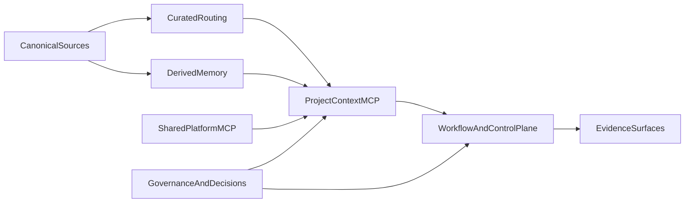

# Best-In-Class Agentic Project Infra

This document describes the upstream architecture for the system that produces this template.

The goal is not to turn the template into a research paper. The goal is to decide what an agentic project should provide, record the load-bearing choices here, and then let the template implement the stable parts cleanly.

## Why this exists

- This repo is upstream of the template, not just a copy target.
- The template should satisfy the design described here, but it should not carry the full thesis, rationale, or every open architectural fork.
- Broad design intent belongs in `docs/design/`. Open load-bearing choices belong in `docs/decisions/backlog.md`. Settled choices belong in `docs/decisions/adr/`.

## Design inputs

- Existing progressive-disclosure rules in [../../.genai/rules/context-efficiency.md](../../.genai/rules/context-efficiency.md) and [../../.genai/rules/maintenance.md](../../.genai/rules/maintenance.md)
- The teaching-first plan in `.cursor/plans/zero-to-one_showcase_97ff6318.plan.md`
- Prior source chat UUID `7d401ca5-9a18-4aaa-9c87-c1b91e4fa8ff`, preserved as an upstream design input

## North star

An agentic project should be able to explain itself, search itself, verify itself, and evolve itself efficiently.

More concretely, a strong agentic project should provide:

- truthful defaults that work from a cold start
- a small happy path before advanced orchestration
- at least one built-in MCP that lets agents ask the project about itself efficiently
- a memory model with explicit provenance and freshness
- evidence-backed workflows for planning, review, debugging, and verification
- optional shared platform help without breaking local-first operation

## Component model

### 1. Canonical source layer

Human-edited truth lives in code, config, docs, rules, skills, learnings, and decision records. These sources remain reviewable in Git and are the only place where architectural truth is authored.

### 2. Curated routing layer

Maps, indexes, ownership docs, ADR indexes, and learnings indexes provide the fast path. Agents should use these before escalating to deeper retrieval.

### 3. Derived memory layer

Chunks, lexical indexes, embeddings, symbol tables, dependency facts, and summaries are generated from canonical sources. They are rebuildable cache, never the primary truth.

### 4. Project-context MCP

Every agentic project should ship a built-in local MCP that gives agents efficient self-query verbs, citations, and task-shaped context bundles.

### 5. Workflow and control plane

The project needs a small honest control surface for setup, verify, doctor, and status. Workflow commands and agents can be richer, but they should compose around the same self-query and evidence surfaces.

### 6. Evidence surfaces

Agents need more than prose recall. They need efficient access to diffs, tests, lints, ownership, dependency edges, recent changes, and relevant decision records.

### 7. Shared platform MCP

An optional shared/org MCP can supply paved-road defaults, templates, cross-project knowledge, reranking, or policy services. It should enrich local work, not replace local operation.

### 8. Governance and safety

Load-bearing choices are recorded as DECs and ADRs. Retrieval results should preserve provenance, freshness, and authority ranking so agents do not confuse similarity with truth.

## Artifact strategy

The system is intentionally split across four artifact types:

- `Design docs` explain the architecture and deep rationale.
- `DEC` backlog entries capture unresolved, load-bearing forks with a forcing trigger.
- `ADR`s capture settled choices that downstream work should not silently violate.
- `Template artifacts` implement the accepted choices in a form that downstream projects can copy and customize.

## Invariants

The following statements are intended to survive template iterations:

- Git-tracked sources remain the canonical ledger for repo truth and provenance.
- Derived retrieval artifacts are never canonical, even when they are fast or useful.
- Curated routing comes before broad retrieval whenever it answers the question.
- Local operation is required; shared services are additive.
- Agents should cite canonical sources whenever possible.
- The first-run path should stay small and truthful, with advanced features explicitly marked as advanced.

## What flows into the template

The template should inherit:

- the progressive-disclosure read path
- the canonical versus derived memory distinction
- the built-in `project-context` MCP pattern
- the local-first plus optional shared-platform model
- the emphasis on evidence-aware workflows
- the separation between core onboarding paths and advanced orchestration

The template should not inherit:

- the full research trail or exploratory rationale
- repo-specific architectural backlog noise
- prematurely-settled implementation details such as a specific vector backend unless they are accepted by decision record

## Near-term open forks

The main unresolved decisions are tracked in [../decisions/backlog.md](../decisions/backlog.md). At the time of writing, those forks include backend choice for local derived memory and the trust boundary between local and shared MCP planes.

## Links

- [README.md](../../README.md)
- [../../AGENTS.md](../../AGENTS.md)
- [../decisions/README.md](../decisions/README.md)
